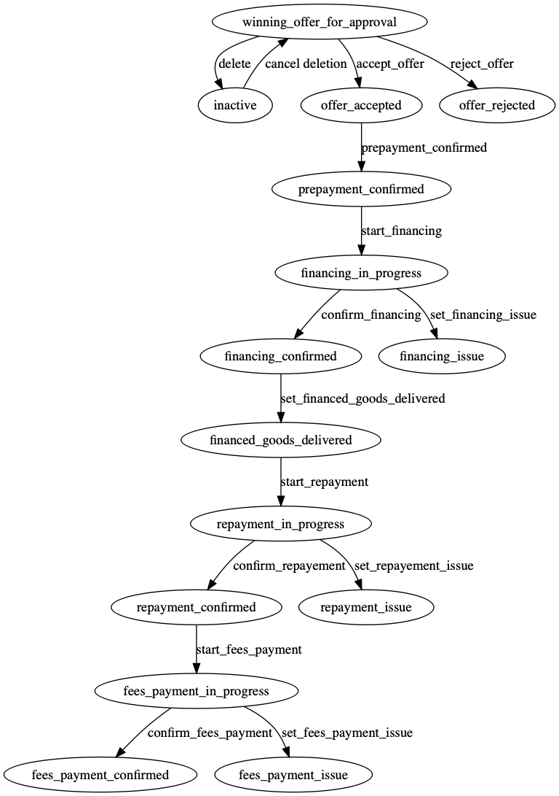

# fsm

[](http://godoc.org/github.com/induzo/fsm) [](https://goreportcard.com/report/github.com/induzo/fsm) [](https://codeclimate.com/github/induzo/fsm/maintainability) [](https://coveralls.io/github/induzo/fsm?branch=master) [](https://circleci.com/gh/induzo/fsm)

finite state machine with dot graph bonus

## Running the example

```bash
go run cmd/main.go
```

Input json graph ./example/graph.json


